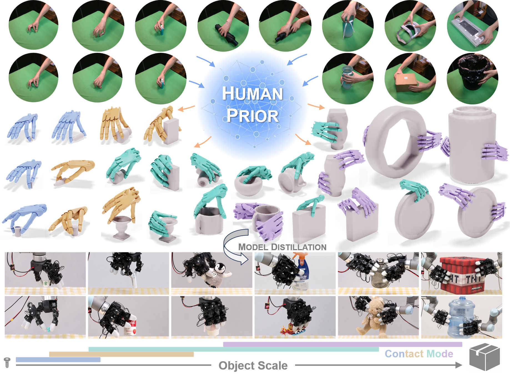

<h1 align="center">HUGS</h1>

<h3 align="center">Guiding Unified Dexterous Grasp Synthesis<br>Across Modes and Scales via Learned Human Priors</h3>

<p align="center"><strong>CoRL 2026</strong></p>

<p align="center">
  <a href="https://hugs-dex.github.io/">Project Page</a> ·
  <a href="https://arxiv.org/abs/2607.04554">Paper</a> ·
  <a href="#code">Code</a> ·
  <a href="#data">Data</a>
</p>

<p align="center">
  <a href="https://hugs-dex.github.io/">
    
  </a>
</p>

**From small screws to large boxes.** HUGS learns human grasp preferences to guide
robot grasp synthesis across contact modes and object scales, combining learned
initializations with force-closure-aware optimization.

**HUGS-Main is the project hub** for the paper, website, datasets, component
repositories, and reproduction guides. Watch the [video](https://hugs-dex.github.io/#overview)
or read the [project blog](https://hugs-dex.github.io/blog.html).

## Highlights

- **Human-guided synthesis.** Learn contact-mode preferences and hand pose priors
  from human grasps to initialize robot-specific optimization.
- **Across modes and scales.** Generate single-hand and bimanual grasps with
  Shadow Hand and Leap-SP, from small pinches to large-object grasps.
- **From synthesis to learning.** Filter candidates in MuJoCo, assemble successful
  grasps into training data, and evaluate learned robot grasp models.

The paper reports **1.8K human grasps over 304 objects** and **3.2M synthesized
robot grasps over 157K scenes**, with object half-diagonal lengths of **2–30 cm**.
Current downloads are listed separately in [Data](#data).

## Code

All three component repositories are public. Choose the entry point for your task:

| I want to… | Repository and quick start | Required inputs |
| --- | --- | --- |
| Generate robot grasps | [HUGS-BODex](https://github.com/hugs-dex/HUGS-BODex#quick-start) | Object scenes; exported priors for human initialization |
| Evaluate and filter grasps | [HUGS-DexGraspBench](https://github.com/hugs-dex/HUGS-DexGraspBench#producer-workflows) | Producer grasps and matching object assets |
| Learn and export Human Priors | [HUGS-DexLearn](https://github.com/hugs-dex/HUGS-DexLearn#human-prior) | Formatted human data and object scenes |
| Train a robot grasp model | [HUGS-DexLearn](https://github.com/hugs-dex/HUGS-DexLearn#robot-grasp) | Prepared robot grasp data and hand assets |

### Getting Started

Clone the component you need and follow its README. Each component has its own
environment, while browsing this project hub requires no Python installation.
The [BODex surface example](https://github.com/hugs-dex/HUGS-BODex#quick-start)
provides a synthesis starting point without a learned prior or checkpoint.

The complete workflow is:

1. **DexLearn Human:** train and export contact-mode scores and hand pose priors.
2. **BODex:** generate robot grasps using those priors, or surface initialization.
3. **Bench:** convert and evaluate the grasps, then collect successful samples.
4. **DexLearn Robot:** train on the assembled samples and generate robot grasps.
5. **Bench:** evaluate the robot model's saved samples.

See the [cross-repository workflow](docs/workflows.md) for artifact paths and
handoffs. You can enter at any stage with compatible inputs already prepared.

## Data

| Download | Available content |
| --- | --- |
| [HUGS](https://huggingface.co/datasets/MingruiYu/HUGS) | Processed DGN_2k object assets, scene configurations, splits, and partial point clouds |
| [HUGS-Human](https://huggingface.co/datasets/MingruiYu/HUGS-Human) | Human grasp processing inputs and formatted training data |

Follow the dataset cards for extraction, checksums, and usage terms. Components
share the dataset-root convention:

```bash
export HUGS_DATASET_ROOT=/path/to/hugs-dataset
```

See [data preparation](docs/data.md) for directory layout and task-specific assets.
The current downloads do not include model checkpoints, exported human priors,
or the full synthesized robot-grasp dataset. MANO models and formatted canonical
meshes require separate preparation where needed. BODex's generated height table
is prepared using its [documented data setup](https://github.com/hugs-dex/HUGS-BODex#prepare-data).

## Documentation

- [Cross-repository workflow and output paths](docs/workflows.md)
- [Data, assets, and availability](docs/data.md)
- [BODex installation and synthesis](https://github.com/hugs-dex/HUGS-BODex#documentation)
- [Bench conversion and evaluation](https://github.com/hugs-dex/HUGS-DexGraspBench#documentation)
- [DexLearn training and export](https://github.com/hugs-dex/HUGS-DexLearn#documentation)
- [Figure reproduction](docs/figures.md) — requires the corresponding raw evaluation records

Component validation notes describe their recorded checks. A complete reproduction
using only the current public downloads has not yet been established; configuration
checks and dry-runs alone do not establish synthesis or model quality.

## Citation

If you find HUGS useful in your research, please cite our paper:

```bibtex
@inproceedings{yu2026hugs,
  title={HUGS: Guiding Unified Dexterous Grasp Synthesis Across Modes and Scales via Learned Human Priors},
  author={Mingrui Yu and Yongpeng Jiang and Yongyi Jia and Kangchen Lv and Xiangjie Yan and Li Huang and Yi Ren and Xiang Li},
  booktitle={Conference on Robot Learning (CoRL)},
  year={2026}
}
```

## Acknowledgements and usage terms

HUGS builds on [BODex](https://github.com/JYChen18/BODex),
[cuRobo](https://github.com/NVlabs/curobo), and the dependencies acknowledged in
each component repository. We thank their authors for making their work available.

Code and datasets retain their respective licenses and usage terms. HUGS-BODex
inherits an NVIDIA license restricting use to non-commercial research or
evaluation; a project-wide license has not yet been selected. This entry repository
does not relicense component code, assets, or datasets.

For project questions, please open an
[issue](https://github.com/hugs-dex/HUGS-Main/issues). For a component-specific bug,
use that component's issue tracker and include the command, code commit, dataset
revision, and relevant logs.
