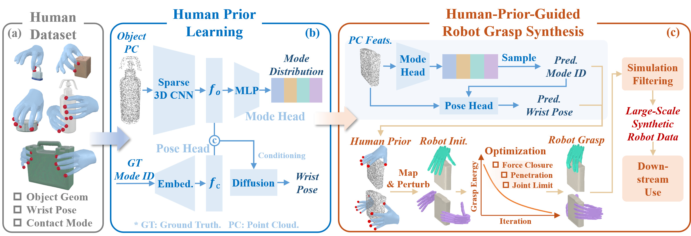

# Cross-Repository Workflow

HUGS-Main connects the project, paper, website, datasets, and component repositories.
Algorithm implementations and runtime environments belong to the components.
Prepare [data and assets](data.md), then start at the stage for which you have inputs.

<p align="center">
  
</p>

## Choose a Starting Point

- **Generate grasps without a learned prior:** start with BODex surface initialization.
- **Use human-guided synthesis:** export a DexLearn Human Prior, then run BODex.
- **Evaluate existing robot grasps:** pass BODex records or DexLearn Robot samples to Bench.
- **Train a robot grasp model:** assemble Bench's collected successes, then use DexLearn Robot.

DexLearn is used twice: first for Human Prior learning, then for Robot learning.
Bench filters synthesis outputs and separately evaluates learned robot outputs.
Human Prior exports contain scores and hand poses; they are not complete robot
joint configurations and do not use Bench's learned-robot conversion path.

## Workspace Layout

Cross-repository path examples assume sibling checkouts:

```text
hugs-workspace/
├── HUGS-Main/
├── HUGS-BODex/
├── HUGS-DexGraspBench/
└── HUGS-DexLearn/
```

Clone only the components you need from the [repository links](../README.md#code).
Follow each component's installation instructions separately. Main needs no Python
environment for navigation; figure scripts have their own documented requirements.
Commands run from the named component's root. Paths below assume default output
roots; if you override a producer root, adjust its consumer's input too.

## 1. Learn and Export Human Priors

Follow [DexLearn Human Prior](https://github.com/hugs-dex/HUGS-DexLearn#human-prior).
The default Independent workflow trains separate type and conditional-pose models.
Its full-data example uses `human_prior_full`, then selects score step `000100`
and pose step `007500` for export.

The Shadow export lives under the DexLearn checkout at:

```text
output/humanMulti_humanMultiHierar_human_prior_full/obj_human_prior/step_007500_000100/DGN_2k/shadow_hand/
```

Pass this robot-specific scene directory as BODex's `task.human_prior.root`.
Preserve scene IDs, units, active-hand masks, and the export's hand-size convention.
BODex needs the export files, not DexLearn's environment or training checkpoints.
Full-data synthesis-prior training is separate from held-out Human model evaluation.

## 2. Synthesize Robot Grasps

Follow [BODex Quick Start](https://github.com/hugs-dex/HUGS-BODex#quick-start) for
`surface_demo`, or [Human Prior](https://github.com/hugs-dex/HUGS-BODex#human-prior)
for `human_demo`. The default suites also require a locally generated height table.

A right-full Shadow result is written below the BODex checkout:

```text
src/curobo/content/assets/output/sim_shadow/tabletop_full/surface_demo/graspdata/
```

Other modes use their own manipulation subdirectories. The quick start bounds
scene selection; a full data-generation run requires an appropriately chosen
scene set and compute budget. A planner dry-run saves no grasps.

## 3. Filter and Collect with Bench

Use the [Bench BODex workflow](https://github.com/hugs-dex/HUGS-DexGraspBench#bodex-grasps)
with the same run name. `HUGS_BODEX_OUTPUT_ROOT` points at BODex's
`src/curobo/content/assets/output/`, containing all manipulation/run folders.

Bench formats the producer records, evaluates them in MuJoCo, and collects successes.
For the example above, outputs are under the Bench checkout:

```text
output/surface_demo_right_full_shadow/
├── graspdata/
├── evaluation/
├── succgrasp/
└── succ_collect/
```

Simulation success follows the resolved evaluation configuration. Viewing a pose
or passing format checks does not establish that success, nor physical-robot success.

## 4. Assemble Data and Train a Robot Model

Follow [Bench dataset preparation](https://github.com/hugs-dex/HUGS-DexGraspBench/blob/main/docs/workflows.md#prepare-a-robot-training-dataset)
to assemble per-type `succ_collect` records with their joint metadata. A small
quick-start run can have missing types; check its contents before using it for training.

The guide's custom assembly example writes
`$HUGS_DATASET_ROOT/BimanBODex_human_demo/shadow/`. DexLearn's default is
`$HUGS_DATASET_ROOT/human_DGN2k_full/shadow/`; the guide shows the required
`data.paths.grasp_path` and `test_data.grasp_path` overrides. Retain object splits,
point clouds, and the matching hand assets.

Follow [DexLearn Robot Grasp](https://github.com/hugs-dex/HUGS-DexLearn#robot-grasp)
with those paths. Training and sampling use `exp_name=shadow`; the example samples
checkpoint `050000` and views the saved samples.

## 5. Evaluate Learned Robot Grasps

Pass DexLearn's saved robot sample root to the
[Bench Learning wrapper](https://github.com/hugs-dex/HUGS-DexGraspBench#learned-robot-grasps):

```text
HUGS-DexLearn/output/shadowMulti_robotMultiHierar_shadow/tests/step_050000/shadowMulti/
```

This path runs format and evaluation, without automatic collect. The formatter
also needs the complete source joint-order metadata under the dataset root.
DexLearn's intrinsic Human score/pose evaluation measures different quantities
and remains in its [Human workflow guide](https://github.com/hugs-dex/HUGS-DexLearn/blob/main/docs/workflows.md#train-and-evaluate).

## Contracts and Reproduction

For exact fields, coordinate conventions, and compatibility, consult the owners:

- [DexLearn data and exports](https://github.com/hugs-dex/HUGS-DexLearn/blob/main/docs/contracts.md)
- [BODex prior inputs and grasp outputs](https://github.com/hugs-dex/HUGS-BODex/blob/main/docs/contracts.md)
- [Bench conversion and evaluation](https://github.com/hugs-dex/HUGS-DexGraspBench/blob/main/docs/contracts.md)

Record producer/consumer commits, data revision, checkpoints, resolved configs,
seeds, and environments with a run. Component smoke tests and configuration checks
have narrower scope than reproducing paper results. See [figure reproduction](figures.md)
for plots requiring saved evaluation records.
